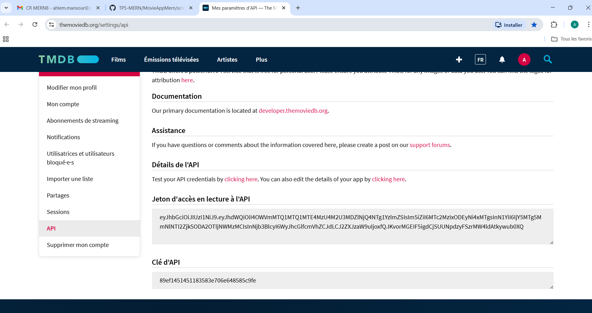
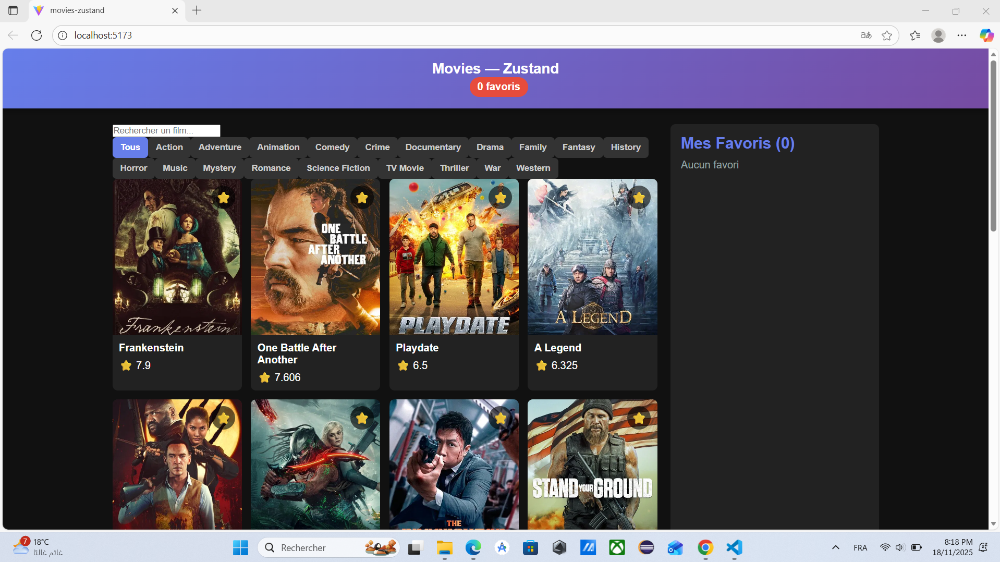
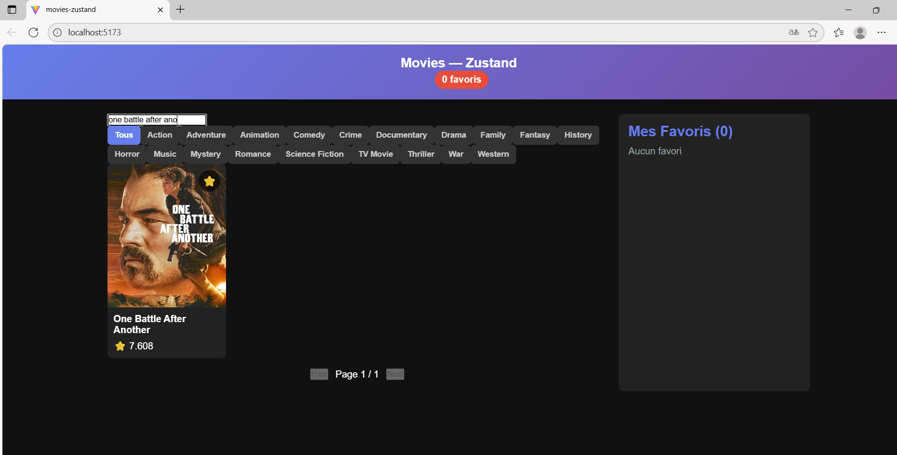
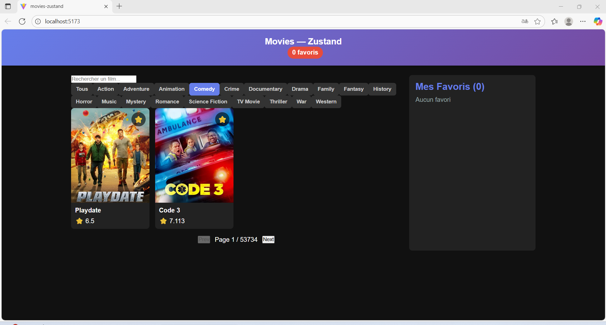
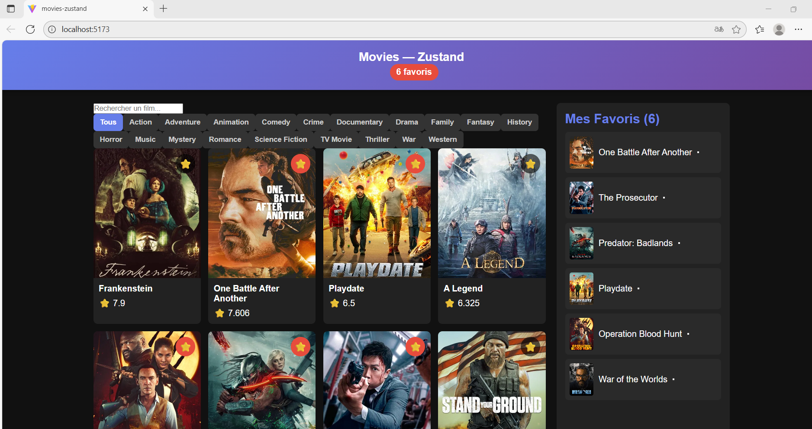

# MovieAppMern

[ Dépôt GitHub](https://github.com/ahlem2man/TPS-MERN/tree/main/MovieAppMern)

## Présentation

Ce dépôt contient trois versions d’une même application de films, développée dans le cadre du cours MERN.  
Chaque version utilise une approche différente pour gérer l’état global :

- **Movies-Context** : Version avec Context API (React)  
- **Movies-Redux** : Version avec Redux Toolkit  
- **Movies-Zustand** : Version avec Zustand  

Toutes ont les mêmes fonctionnalités :  
- Chargement des films populaires depuis l’API :contentReference[oaicite:0]{index=0} (TMDb)  
- Recherche par titre  
- Filtre par genre  
- Système de favoris  
- Section “Favoris” séparée  
- Pagination  
- Interface identique / CSS commun

---

Pour chaque version (`Movies-Context`, `Movies-Redux`, `Movies-Zustand`) :
1. Copier le dossier localement  
2. Ouvrir un terminal dans le dossier  
3. Créer un fichier `.env` à la racine du dossier contenant :  
VITE_TMDB_API_KEY=VOTRE_CLE_API_ICI

5. Installer les dépendances :  
npm install
6. Lancer la version :  
npm run dev
##  Comparatif des trois approches

| Approche       | Gestion d’état         | Avantages                                                  | Inconvénients                                      |
|----------------|------------------------|-------------------------------------------------------------|----------------------------------------------------|
| Context API    | `useContext + useReducer` | Intégré à React, facile pour démarrer                     | Boilerplate, re-renders, peu scalable              |
| Redux Toolkit  | `@reduxjs/toolkit`      | Structure solide, middleware, devtools                      | Plus verbeux, nécessite organisation                |
| Zustand        | `zustand`               | Très léger, facile à apprendre, performant                | Nécessite installation, moins “standard”            |

**Détails :**

-  *Context API* est idéal pour des applications de petite taille ou pour apprendre.  
-  *Redux Toolkit* est standard en entreprise pour des apps complexes.  
-  *Zustand* combine simplicité + performance, excellent pour des états globaux rapides.

---

## Fonctionnalités communes:

- Affichage des films populaires (via TMDb)  
- Recherche par titre  
- Filtre par genre  
- Pagination  
- Ajout/retirer des favoris (avec persistance locale)  
- Section “Favoris” dans une barre latérale  
- CSS commun pour design cohérent

##  Captures d’écran
### Page d’accueil  

###  Recherche  

###  Filtrage par genre  

###  Favoris  

##  Conclusion

Ce projet m’a permis d’explorer trois approches différentes pour la gestion d’état dans React.  
- Avec **Context API**, j’ai appris les fondations.  
- Avec **Redux Toolkit**, j’ai mis en place une architecture solide.  
- Avec **Zustand**, j’ai découvert la simplicité et la performance.

Pour des applications modernes connectées à une API, je recommande **Zustand** pour l’état local + **React Query** pour les données asynchrones.  
Ce trio offre une base performante, évolutive et propre.

