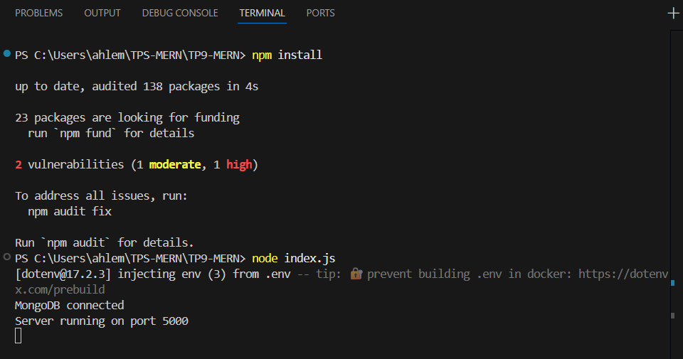
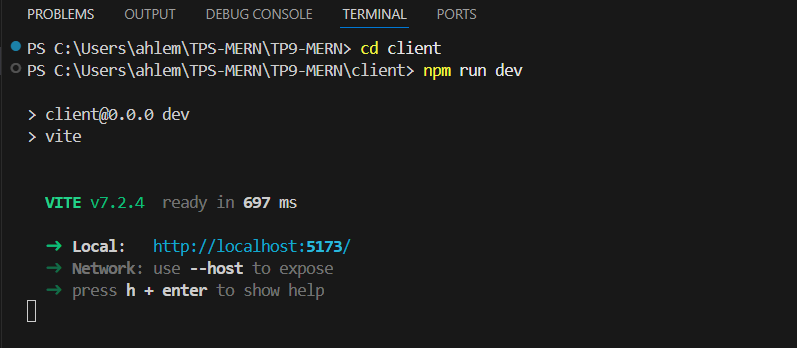
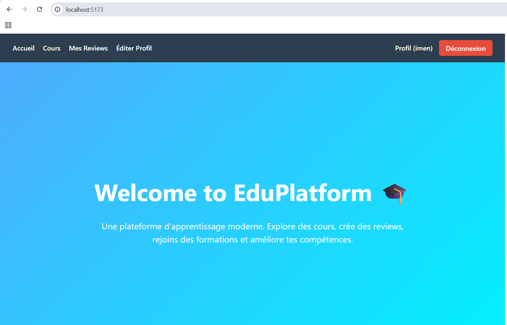
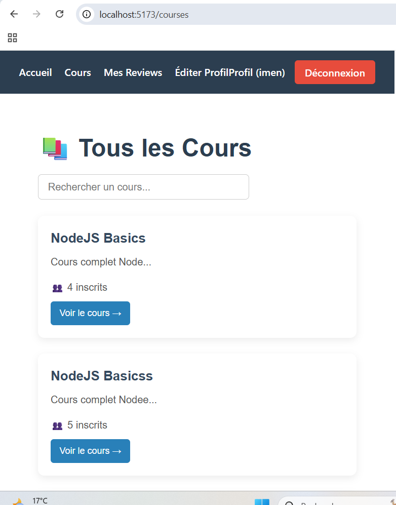
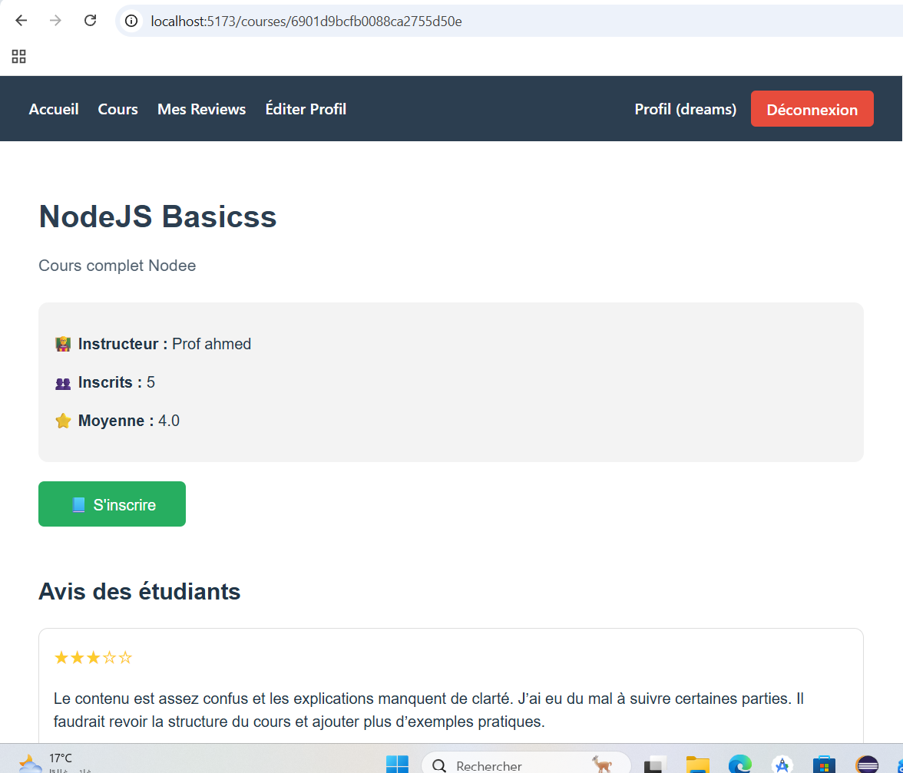
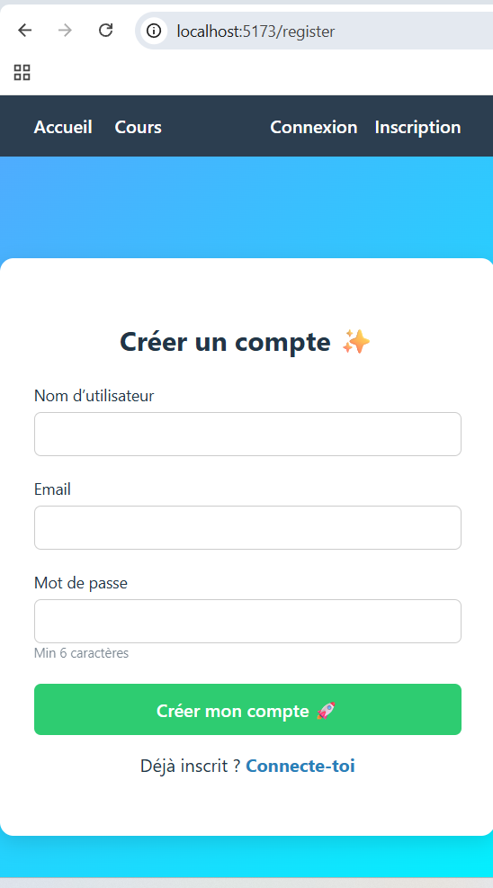
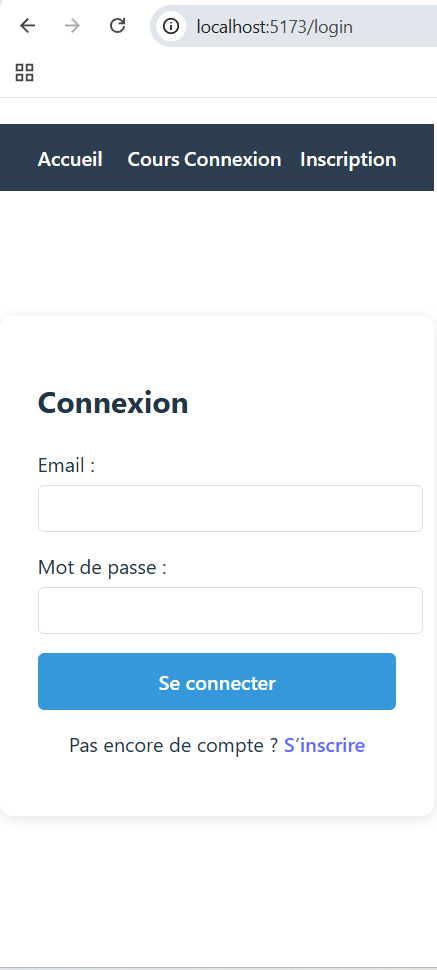
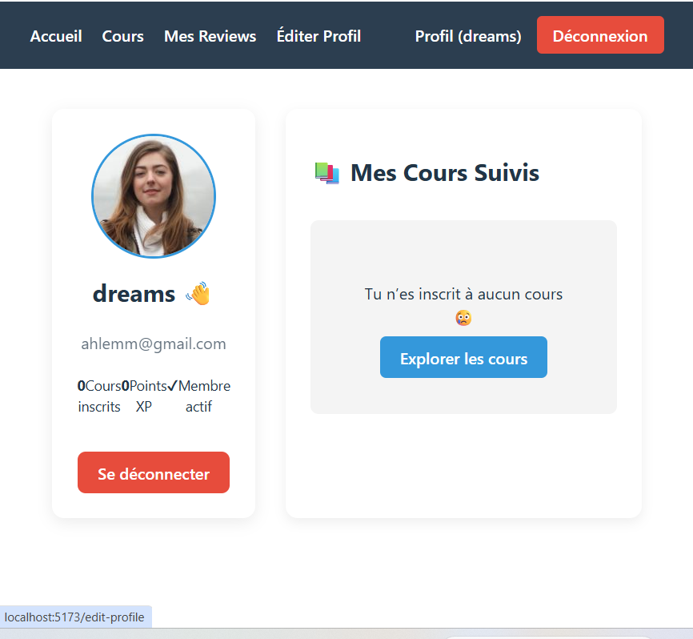
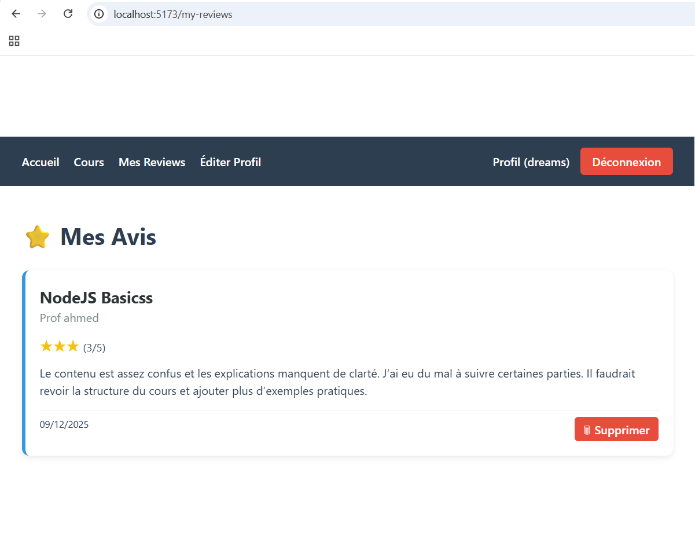

# 📚 EduPlatform — Application MERN complète (TP9)

Plateforme web éducative permettant aux utilisateurs de s'inscrire, se connecter, consulter des cours, laisser des avis et suivre leur profil.  
Projet développé en **MERN Stack** pour le module de développement Web avancé.

## 🚀 Technologies Utilisées

| Côté Client (Front-end) | Côté Serveur (Back-end) | Base de données |
|------------------------|------------------------|-----------------|
| React + Vite           | Node.js + Express      | MongoDB Atlas    |
| Axios                  | JSON Web Token (JWT)   | Mongoose         |
| React Router           | bcryptjs               |                  |

---

## 📦 Installation & Lancement

2️⃣ Lancer le Backend:

Par défaut il tourne sur :
➡ http://localhost:5000

3️⃣ Lancer le Frontend :

👉 Ouverture auto sur http://localhost:5173

🔑 Fonctionnalités

✔ Création de compte & Authentification sécurisée (JWT)
✔ Connexion / Déconnexion
✔ Liste des cours disponible
✔ Détails d’un cours + Avis utilisateur
✔ Inscription à un cours
✔ Page Profil + Historique utilisateur
✔ API REST complète & testable sur Postman

| Méthode | Route                     | Description                    |
| ------- | ------------------------- | ------------------------------ |
| POST    | `/api/auth/register`      | Inscription utilisateur        |
| POST    | `/api/auth/login`         | Connexion & génération token   |
| GET     | `/api/courses`            | Liste des cours                |
| GET     | `/api/courses/:id`        | Details d’un cours             |
| POST    | `/api/courses/:id/enroll` | Inscription à un cours         |
| POST    | `/api/reviews/:id`        | Ajouter un avis                |
| GET     | `/api/users/:id/courses`  | Cours suivis par l'utilisateur |

🖼 Captures d’Écran

📍 Ajouter dans /screenshots/:
| Page                                     | Screenshot   |
| ---------------------------------------- | ------------ |
| Page d'accueil                           |     |
| Liste des cours                          |  |
| Détails d'un cours + bouton "S'inscrire" | |
| Page Register                            |  |
| Page Login                               |     |
| Page Profil utilisateur                  |  |
| Ajout d’un avis + inscription réussie    |  |
